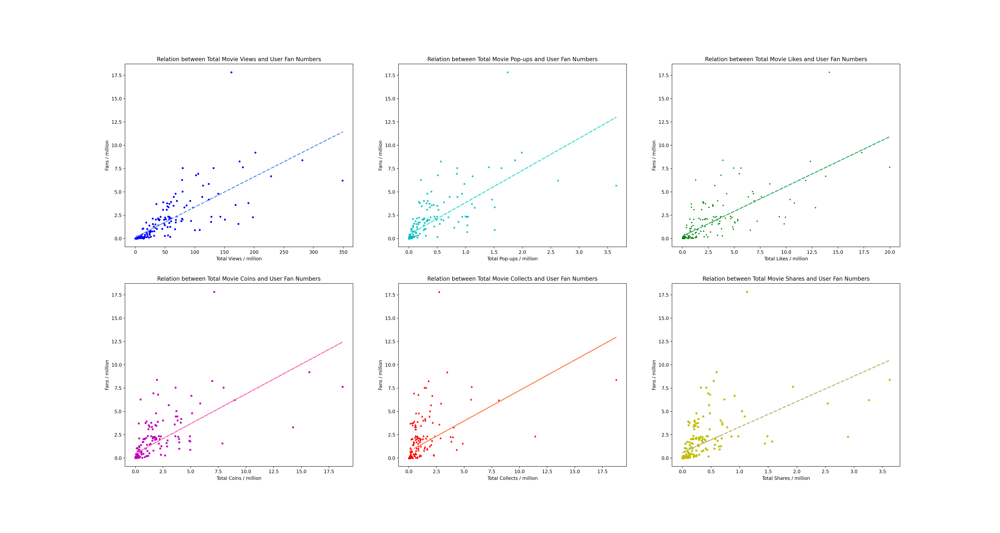
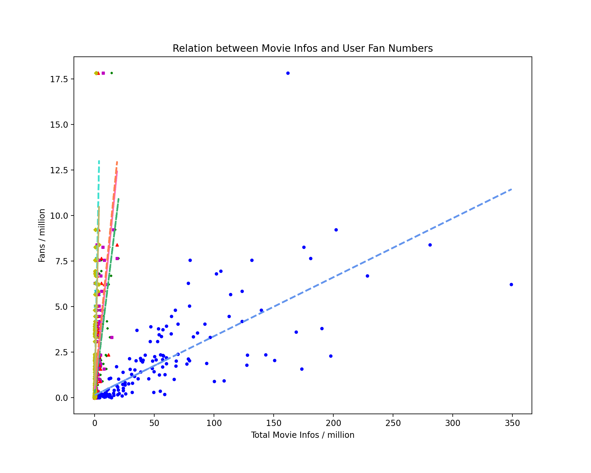
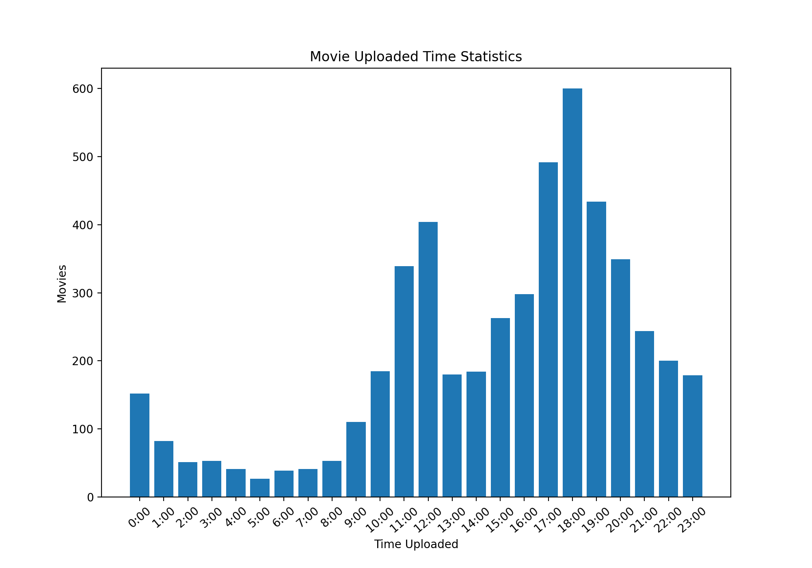
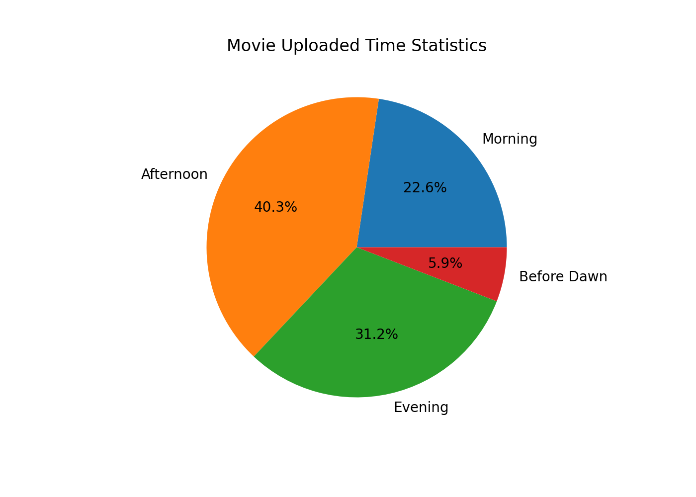
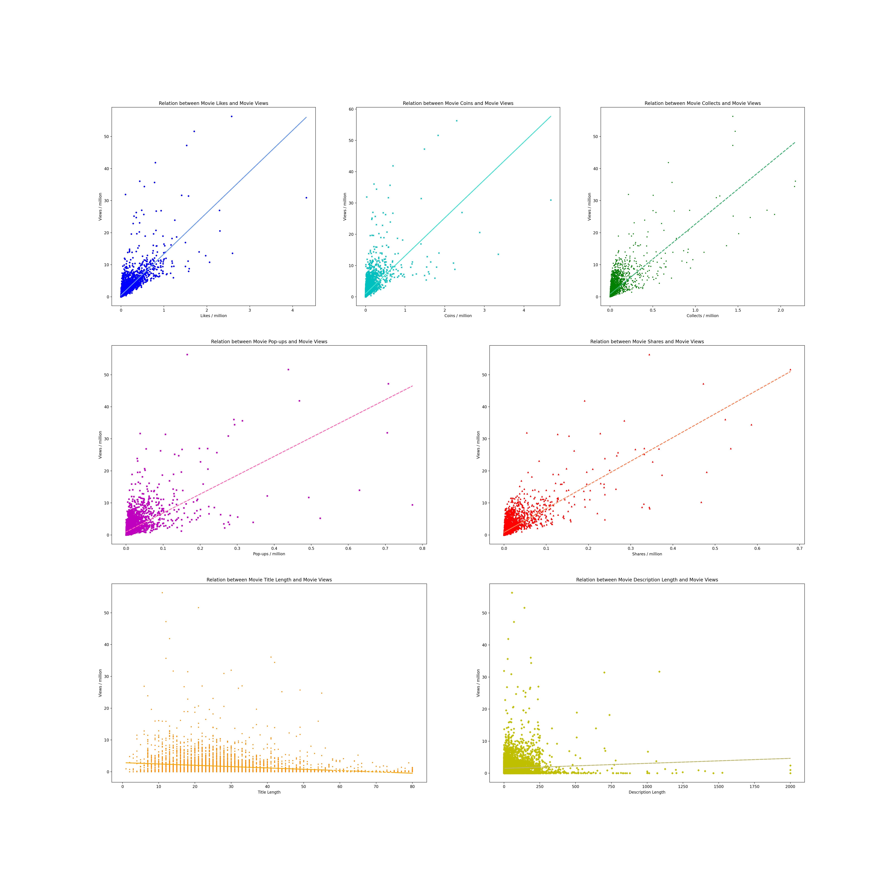
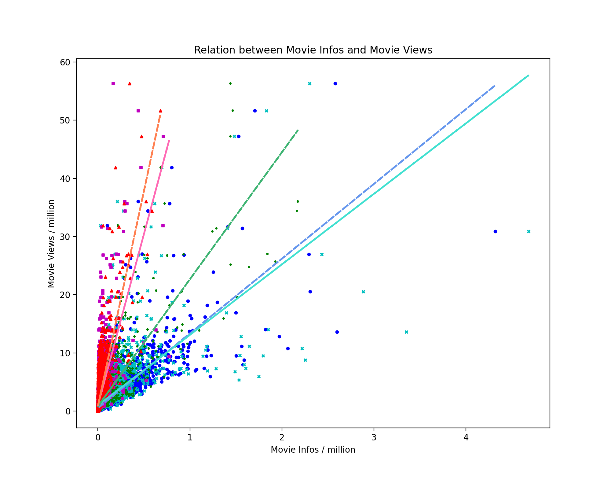

## Python大作业 数据分析

> 姓名：王昊华
>
> 学号：2020010942
>
> 班级：计04

### 1. 用户的视频相关信息与用户粉丝数的相关性：

> 自变量：用户总视频播放数、用户总视频弹幕数、用户总视频点赞数、用户总视频投币数、用户总视频收藏数、用户总视频分享数
>
> 因变量：用户粉丝数

通过对用户上传的视频相关的信息（即用户总视频播放数、用户总视频弹幕数、用户总视频点赞数、用户总视频投币数、用户总视频收藏数、用户总视频分享数这6条）与用户粉丝数的数据进行散点图绘制；再根据散点图的坐标分布求出拟合回归直线，近似为正比例函数，因此得出结论：

- ##### 用户的总视频播放数与用户粉丝数呈正相关；

- ##### 用户的总视频弹幕数与用户粉丝数呈正相关；

- ##### 用户的总视频点赞数与用户粉丝数呈正相关；

- ##### 用户的总视频投币数与用户粉丝数呈正相关；

- ##### 用户的总视频收藏数与用户粉丝数呈正相关；

- ##### 用户的总视频分享数与用户粉丝数呈正相关。

### 2. 视频发布时间分布：

> 横坐标：一天24小时
>
> 纵坐标：视频在该时间段上传的总频次

使用频次直方图（柱状图），统计一天24小时中每一小时间隔之中视频上传的总数；并用饼图来进一步直观展现视频发布时间的大致分布，得出结论：

- ##### 用户最喜欢在下午（13:00-19:00）上传视频，最不喜欢在凌晨（1:00-7:00）上传视频。

### 3. 视频相关信息与该视频播放量的相关性：
> 自变量：视频弹幕数、视频点赞数、视频投币数、视频收藏数、视频分享数、视频标题长度、视频描述长度
> 因变量：视频播放量

通过对每一个视频的相关信息（即视频弹幕数、视频点赞数、视频投币数、视频收藏数、视频分享数、视频标题长度、视频描述长度这7条）与该视频播放量的数据进行散点图绘制；再根据散点图的坐标分布求出拟合回归直线，其中以视频弹幕数、视频点赞数、视频投币数、视频收藏数、视频分享数这5条视频信息为横轴的拟合回归直线近似为正比例函数，以视频标题长度为横轴的拟合回归直线近似为反比例函数，以视频描述长度为横轴的拟合回归直线近似为常函数，因此得出结论：

- ##### 视频的弹幕数与播放数呈正相关；

- ##### 视频的点赞数与播放数呈正相关；

- ##### 视频的投币数与播放数呈正相关；

- ##### 视频的收藏数与播放数呈正相关；

- ##### 视频的分享数与播放数呈正相关；

- ##### 视频的标题长度与播放数呈负相关；

- ##### 视频的描述长度与播放数不具有相关性。

