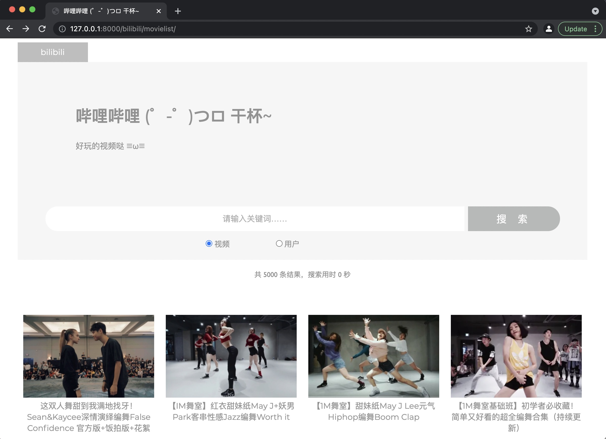
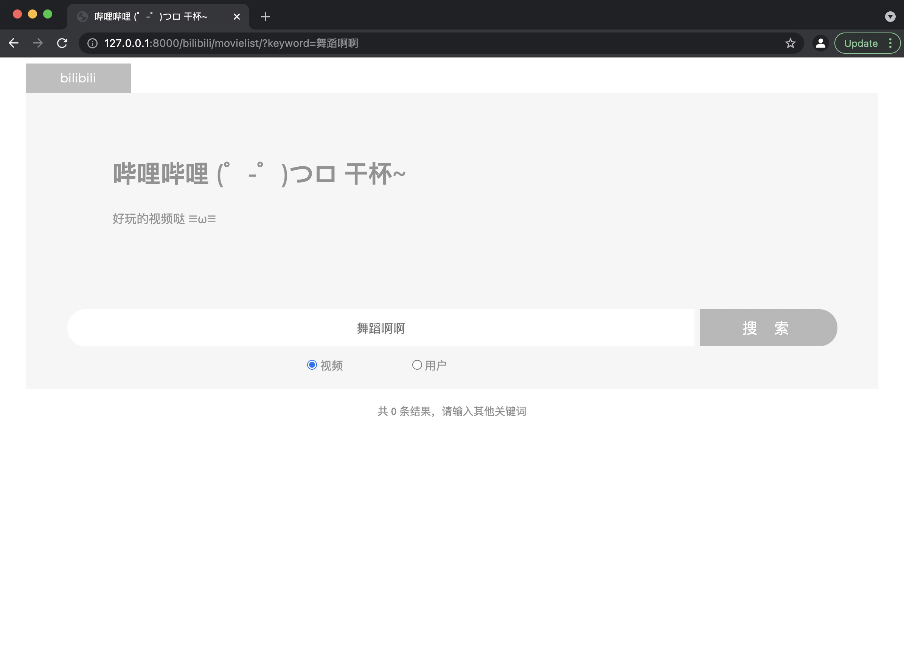
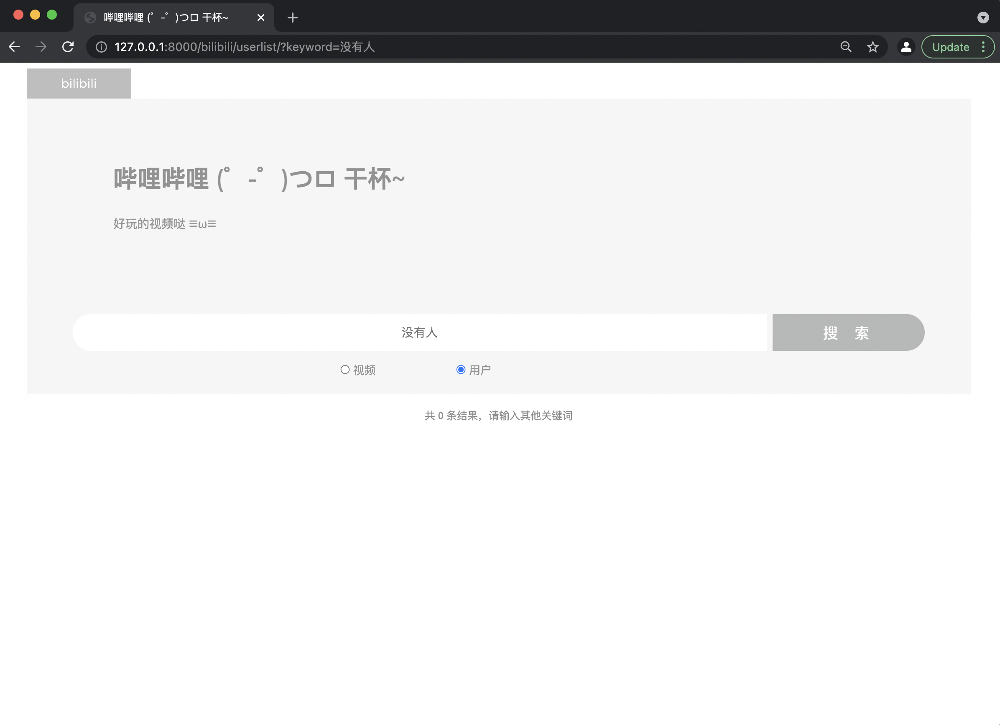
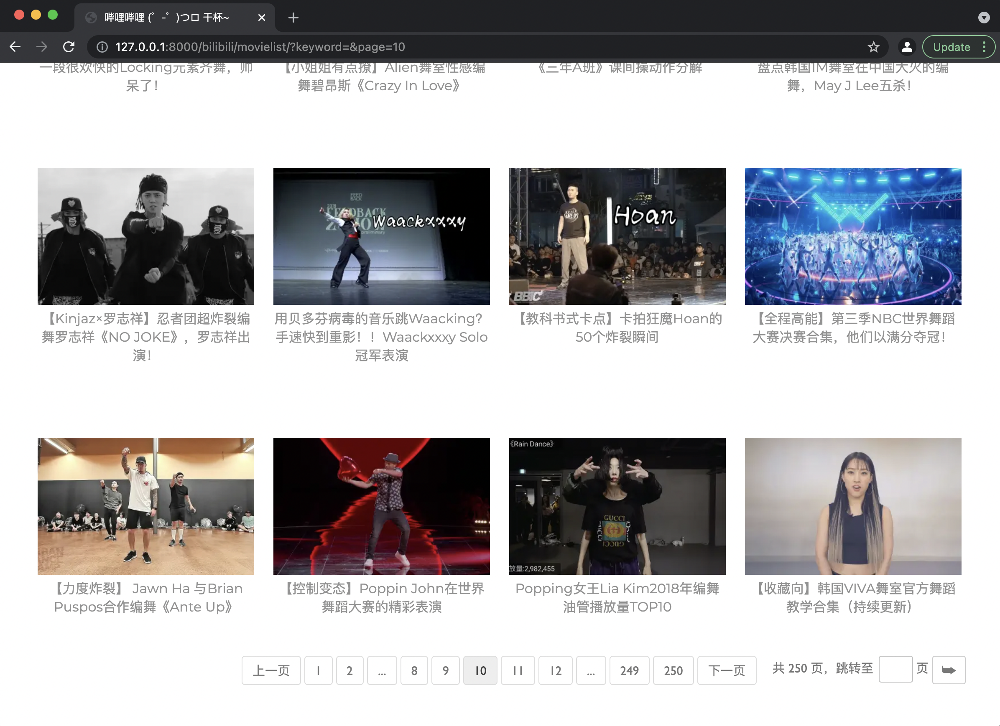
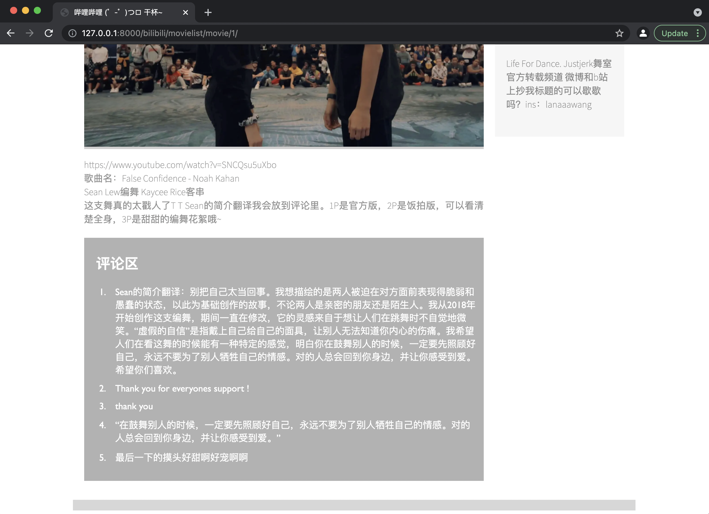

### Python大作业 项目设计

> 姓名：王昊华
>
> 学号：2020010942
>
> 班级：计04


### 一、系统功能

1. 视频、用户列表页（含搜索结果页）

   1. 显示功能：视频页/用户页左上角显示网页Logo，中间向右对齐显示网页名称、简介，搜索栏底部展示结果条数、搜索用时，最后展示视频封面及标题信息/用户头像及用户名信息。

      

      

   2. 搜索功能：输入关键词（不超过50字符）

      1. 若不输入关键词直接点击搜索，则返回视频列表页/用户列表页；

      2. 若输入50字符以内关键词，点击搜索：

         1. 若视频标题或介绍/用户昵称或介绍中包含关键词，则返回包含该关键词的视频/用户列表，并显示结果条数、搜索用时；

            

            

         2. 若视频标题或介绍/用户昵称或介绍中不包含关键词，则显示“共0条结果，请输入其他关键词”字样。

            

            

   3. 视频/用户列表页切换功能：点击单选组控件即可实现列表切换。

   4. 页码功能：

      

      1. 前、后页翻页：点击上一页/下一页可实现前/后页翻页。
      2. 本页码周围页码点击：当前页码周边5个页码会显示在页码栏中，可点击实现页码跳转。
      3. 页码跳转：在输入框中输入页码，点击跳转：
         1. 若页码合法（为首页至末页之间的整数），则跳转到输入的页码页处；
         2. 若页码不合法，则跳转至首页（输入内容不是整数）或末页（输入非法整数）。

   5. 视频/用户查看详情功能：点击列表页的视频/用户信息，即可跳转至视频/用户信息页。

2. 视频信息页：

   

   

   1. 菜单栏功能：点击右上角视频列表/用户列表按键，跳转至视频列表页/用户列表页。
   2. 显示功能：左上角显示网页Logo，页面左侧区域显示视频标题、播放量、弹幕数、点赞数、投币数、收藏量、分享数、发布日期、视频封面图、视频描述、视频评论区（若有大于等于5条评论，则显示前5条；若不足前5条，则全部显示），页面右侧显示该视频作者的用户名、头像、用户介绍。
   3. 跳转功能：
      1. 点击视频标题或视频封面图，将跳转至bilibili原视频链接；
      2. 点击用户名或用户头像，将跳转至用户信息页。

3. 用户信息页

   

   1. 菜单栏功能：点击右上角视频列表/用户列表按键，跳转至视频列表页/用户列表页。
   2. 显示功能：左上角显示网页Logo，显示用户头像、用户名、粉丝数、用户介绍，视频列表处显示该用户上传的视频（封面图及标题）。
   3. 跳转功能：
      1. 点击用户头像、用户名，将跳转至bilibili原用户空间链接；
      2. 点击视频标题或视频封面图，将跳转至视频信息页。


### 二、数据量

1. 用户：共250个用户，每个用户用Django的SQLite数据库以`models.CharField`格式存储其bilibili原用户空间连接、用户头像链接、用户名、粉丝数、用户介绍，以`models.ManyToManyField`格式存储其发布的视频。
2. 视频：共5000个视频（每个用户20个视频），每个视频用Django的SQLite数据库以`models.CharField`格式存储其bilibili原视频链接、视频标题、播放数、弹幕数、点赞量、投币数、收藏量、分享数、发布时间、视频描述、评论，以及该视频作者的bilibili原用户空间连接、用户头像链接、用户名、粉丝数、用户介绍。


### 三、查询信息

1. 存储方法：

   1. 创建继承自Django自带的模型层`models.Model`的类`Movie`和`User`，并声明其成员变量的类型；
   2. 通过运行`python manage.py loaddata data.json`指令，将爬取的json格式数据导入Django的SQLite数据库。

2. 查询方法（只展示视频查询代码，用户查询同理）：

   1. 前端网页输入关键词，通过`get`请求，将关键词传给后端py文件中；

      ```html
      <form action="/bilibili/movielist" method="get">
          <input type="text" name="keyword" id="search" placeholder="请输入关键词……"/>
          <button type="submit" value="搜索" class="searchButton">搜索</button>
      </form>
      ```

   2. 后端views.py文件中通过`request`获取`get`请求的关键词，用Django的SQLite数据库自带的`filter`函数进行筛选，实现关键词查询。

      ```python
      movie_list = models.Movie.objects.all().filter(moviename__icontains=keyword) | models.Movie.objects.all().filter(moviedescription__icontains=keyword)
      ```


### 四、使用的技术和算法

1. 爬虫
   1. Beautifulsoup4
      1. 通过基础链接如`base_url = 'https://search.bilibili.com/upuser?keyword=%E8%88%9E&page='`，通过for循环生成数个用户搜索结果页`url = base_url + '&page=' + str(i)`；
      2. 对于每个`url`，利用伪装`User-Agent`的`headers`，用`requests.get`函数获取该网址的静态html内容，每次请求间隔3秒；
      3. 用`BeautifulSoup`处理获取的html内容，再用`find_all`/`find`函数来找到所有含有某参数信息/第一个含某参数信息的内容，获得用户ID相关信息。
   2. Selenium动态爬取
      1. 通过`webdriver.Chrome`函数创建驱动（本项目使用谷歌浏览器驱动），通过前述爬取的用户ID相关信息生成链接如`url = 'https://space.bilibili.com/' + str(userID) + '/video'`后，用`get`函数打开网页并获取该网页动态生成的html内容；
      2. 用`find_element_by_css_selector`/`find_elements_by_css_selector`函数定位到含该css参数的信息，来获得用户相关信息/其制作的视频链接信息；
      3. 再通过`get`函数打开视频网页并获得动态生成的html内容，通过`find_elements_by_css_selector`函数获得视频相关信息（不包括评论）；
      4. 用`execute_script('window.scrollBy(0,document.body.scrollHeight)')`以及`execute_script('window.scrollBy(0,1000)')`函数实现向下滚动页面，来动态获取评论区内容，并在评论区内容已生成后，通过`find_elements_by_css_selector`获得评论区内容；
      5. 上述行为每个用户抓取间隔为4秒，视频间隔为8秒，全部抓取完毕后运行`quit()`函数退出驱动。
2. 网站搭建
   1. Django框架：用Django模型层存储视频及用户的数据，试图层配置url并简单实现response和request的前后端交流，表单来快速使用get和post指令并在html文件中使用py文件中传来的数据。
   2. CSS、JS美化：通过标签、class、id等信息，使用CSS文件美化视图；通过Javascript代码（本项目没有单独的js文件，而是将代码以<script></script>的形式内嵌在html文件中）实现函数跳转、循环书写html的操作。
   3. SQLite数据库：与Django的模型层以及针对模型的表单共同作用，更好的实现数据的增、删、查、改等操作。
3. 数据分析
   1. Numpy数组运算：将`list`转化为`numpy.array`格式，实现更快速的数组运算。
   2. Matplotlib绘图：用`matplotlib.pyplot.scatter`函数实现散点图，`matplotlib.pyplot.bar`函数实现柱状图，`matplotlib.pyplot.pie`实现饼图。


> ***References:***
>
> *https://www.bilibili.com/video/av81157381*
>
> *https://blog.xieqk.com/posts/36033.html*
>
> *https://blog.csdn.net/weixin_45304503/article/details/104815267*
>
> *https://www.jianshu.com/p/7f5640f571ba*
>
> *https://blog.csdn.net/s_kangkang_A/article/details/102911301*
>
> *https://blog.csdn.net/weixin_39756416/article/details/110706294*
>
> *https://blog.csdn.net/qq_44267691/article/details/104262616*
>
> *https://blog.csdn.net/qq_39360565/article/details/104358982*
>
> *https://blog.csdn.net/zdx1996/article/details/86583676*
>
> *https://blog.csdn.net/qq_42874635/article/details/114636142*
>
> *https://cdn.jsdelivr.net/npm/bootstrap@3.3.7/dist/css/bootstrap.min.css*
>
> *https://blog.csdn.net/weixin_42347925/article/details/112379383*

